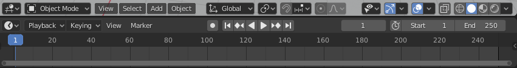
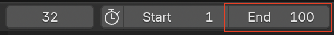

## Keyframing

Let's animate your car!

For a stop frame animation (also known as stop motion animation), you have to create all of the frames by yourself. This is a lot of work, which is why you are going to use **keyframing**.

For key frame animation, the animator creates images for particular points in the animation and asks the computer to work out all the other images in between. For example, if your car starts at its current position and four seconds later it should be next to the snowman, the computer will work out a way of driving the car from the start position to the snowman — you don't have to create all the frames by yourself.

At the bottom of the Blender window, there is a timeline with a green bar.

At the moment it is set to 250 frames, which means 250 images will be output by the computer for the animation. There are 24 frames in 1 second, so 250 images would give you slightly more than 10 seconds of animation. For this project, you only want just over 4 seconds worth of animation, so let's set the end frame to 100.

+ Locate the box for **End frame** at the bottom of the screen.

+ Set the **End frame** by typing `100` into the box, then press <kbd>Enter</kbd>.