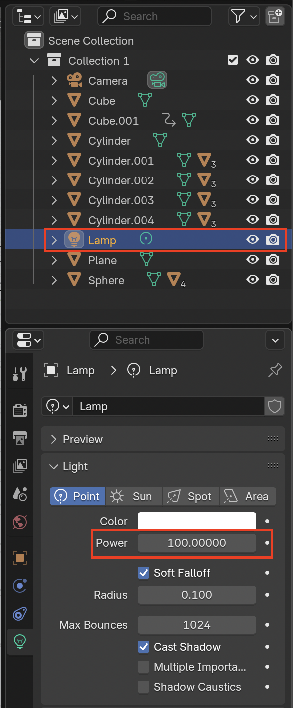

## Where is the camera?

--- task ---

Download and open the [starter project](resources/snow-scene-starter.blend){:target="_blank"}.

--- /task ---

You will animate the car to follow this route:

The first thing you should do when animating is check where the camera is.

--- task ---

Go to render view by pressing <kbd>F12</kbd> (or <kbd>FN + F12</kbd> if you're using a Mac) to see what the scene looks like.

The camera angle is not quite right, as you can only see the tip of the snowman's head at the bottom of the screen, and not the whole snowman.

--- /task ---

--- task ---

Press <kbd>ESC</kbd> to get out of the render view.

--- /task ---

--- task ---

Click on the camera to select it.

--- /task ---

--- task ---

Rotate your view a little bit until you can see both the camera and the scene.

--- /task ---

--- task ---

Select the move tool and move the camera down using the blue handle.

--- /task ---

--- task ---

Go to render view by pressing <kbd>F12</kbd> (<kbd>FN + F12</kbd> on a Mac) again to check whether you can now see the whole snowman.

If not, exit the render view and lower the camera a little bit more. 

--- /task ---

**Tips:**
+ If the camera is too low, pull it up a little bit instead. 
+ Continue rendering and checking until you have everything in view. 
+ If the scene is too dark, select the Lamp in the Collection (at the top right) and increase the Power value.

