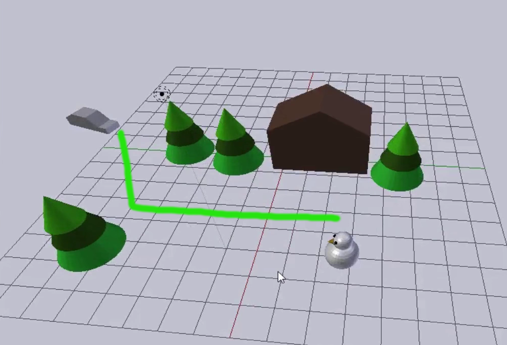
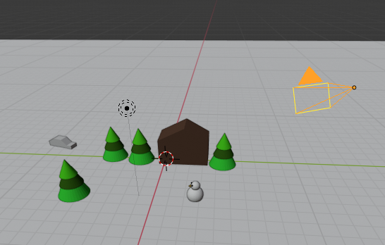

## Where is the camera?

+ Download and open the [starter project](resources/snow-scene-starter.blend){:target="_blank"}

You will animate the car to follow this route:

The first thing you should do when animating is check where the camera is.

+ Press <kbd>F12</kbd> (or <kbd>FN + F12</kbd> if you're using a Mac) to see what the image looks like.

The camera angle is not quite right as you can only see the tip of the snowman's head at the bottom rather than the whole snowman.

+ Press <kbd>ESC</kbd> to get out of the render view.

+ Right click on the camera to select it.

+ Rotate your view a little bit until you can see both the camera and the scene.

+ Move the camera down using the blue handle.

+ Press <kbd>F12</kbd> (<kbd>FN + F12</kbd> on a Mac) again to see whether you can now see the whole snowman.

If not, exit the render view and lower the camera a little bit more. If the camera was too low, pull it up a little bit instead. Continue rendering and checking until you have everything in shot.

