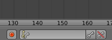
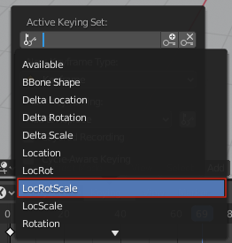

## Key frame the first frame

The car is at its starting position in frame 1, and it should be next to the snowman in frame 90.

Let's set frame 1 as the first key frame. This is like telling the computer "At frame 1, remember that you are here."

+ Make sure that you are on frame 1 by checking the frame number at the bottom of the timeline.

+ Make sure that the car is selected — right-click on it to select it.

+ Click the **Keys** icon at the bottom of the timeline, and select **LocRotScale** to record the location, rotation, and scale of the car in the start frame.

The computer will work out where the car is, which way it is facing, how it is rotated, and how big it is.

+ Click on the small key on the right-hand side of the **Keys** icon to create a key frame.

You can see the key frame represented by a yellow bar on the timeline.
