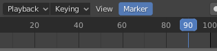

## Key frame the end frame

+ Move the green bar on the timeline to frame 90. You can check the frame number in the menu at the bottom.

+ Move the car next to the snowman using the blue, green, and red handles.

Now the car is next to the snowman in frame 90.

+ Click the **Key** icon again. A yellow bar should appear on the timeline at frame 90.

The computer will work out all the steps of the animation in between frame 1 and frame 90.

+ Move the green bar on the time line to frame 0, or type in 0 at the bottom.

+ Click **Play** on the controls at the bottom.

The car will move from its starting position to next to the snowman. However, there is a bit of an issue — the car drives directly into the trees rather than going around them!

