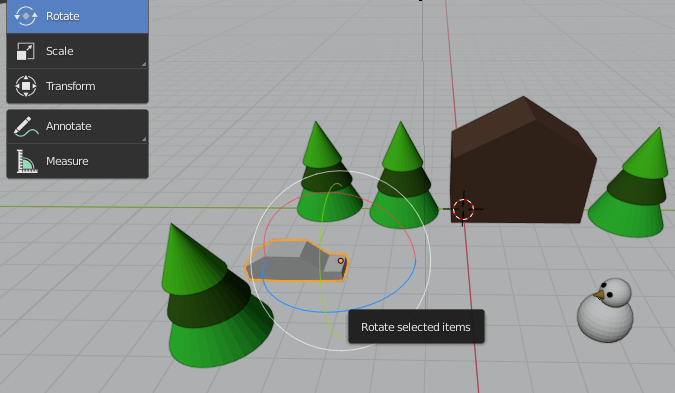

## Fine-tune the animation

It would be much better if the car drove between the trees and then towards the snowman. At about frame 40 (approx. 2 seconds) of the animation, the car needs to be between the trees.

+ Click the **Pause** button on the controls to stop the animation.

+ Move the blue box on the timeline to frame 40.

+ Move the car to a good position between the trees.

+ Click the **Key +** icon again to create another key frame. Now there should be three yellow diamonds on the timeline.

+ Click the **Play** button.

The car now drives around the trees towards the snowman. However, you may have noticed that the angle of the car (its rotation) makes the car look like it is sliding rather than driving. You can fix this by also rotating the car in frame 40.

+ Select frame 40 on the timeline and remove the key frame you just made by clicking the key with the x beside it.

+ Select the **Rotate** tool.

+ Rotate the car so that it is pointing in the direction of the snowman.

+ Click the **Key +** icon to re-add the key frame.

+ Click **Play** to see what it looks like. It probably looks like the car is driving on ice. Quite funny, but good enough for now. Try to improve the animation.
