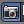
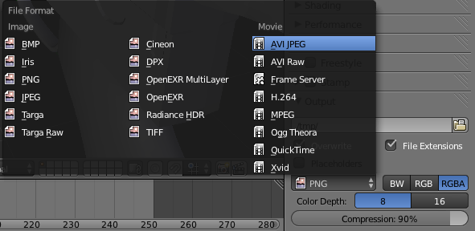

## Exporting a video

You can get Blender to export your animation as a video that you can show to your frieds, even if they don't have Blender installed. This process is called "rendering".

+ Render the animation

Up until now, you've rendered an individual frame, by pressing <kbd>F12</kbd> (or <kbd>FN + F12</kbd> if you're using a Mac). You can render the movie by clicking Render > Render animation (or using the shortcut: <kbd>Ctrl + F12</kbd>).

+ Render as a video

By default, Blender will save each frame as a seperate ".png" image into your "tmp" directory. You can change both of these by clicking on the render tab:

On the drop down that currently says "PNG", you can click it and select "AVI JPEG".

+ Choose save destination

You can tell Blender to save your video somewhere you can find it, by selecting on the Output directory, and browsing to your desktop.

Once this is all configured, render the video again using using <kbd>Ctrl + F12</kbd>. There will now be a ".avi" file in your selected destination that contains the animation.
