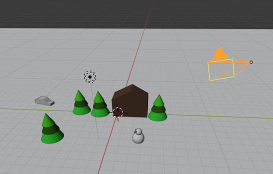

## ¿Dónde está la cámara?

\--- task \---

Descarga y abre el [proyecto inicial](resources/snow-scene-starter.blend){:target="_blank"}.

\--- /task \---

Vas a animar el auto para que siga el recorrido de la imagen:

Lo primero que hay que hacer al animar es revisar la posición de la cámara.

\--- task \---

Render the image by clicking ‘Render Image’ in the ‘Render’ menu to see what the scene looks like.

El ángulo de la cámara no es del todo correcto, ya que solo se puede ver el extremo de la cabeza del muñeco de nieve en la parte inferior de la pantalla pero no todo el muñeco.

\--- /task \---

\--- task \---

Presiona <kbd>ESC</kbd> para salir de la vista de renderizado.

\--- /task \---

\--- task \---

Haz clic sobre la cámara para seleccionarla.

\--- /task \---

\--- task \---

Gira la vista de a poco hasta que logres ver la cámara y la escena.

\--- /task \---

\--- task \---

Selecciona la herramienta "mover" para bajar la cámara usando la flecha azul.

\--- /task \---

\--- task \---

Para revisar si se puede ver todo el muñeco de nieve, presiona <kbd>F12</kbd> (o <kbd>FN + F12</kbd> si estás usando una Mac) para renderizar la imagen.

Si aún no se lo ve, sal de la vista de renderizado y baja la cámara un poco más.

\--- /task \---

**Tips:**

+ Y si la cámara está demasiado baja, súbela un poco. 
+ Continúa renderizando y comprobando hasta que logres tener toda la vista completa. 
+ If the scene is too dark, select the Lamp in the Collection (at the top right) and increase the Power value.

