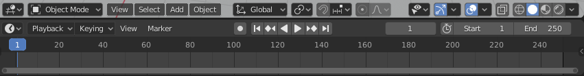
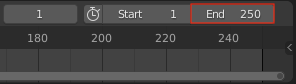

## Cuadros claves (o "Keyframing")

¡Vamos a animar el auto!

Para una animación de cuadro por cuadro (también conocida como animación "stop-motion"), tienes que crear todos los cuadros uno por uno. Esto requiere de mucho trabajo, por lo que tienes que utilizar un método conocido como **keyframing**, o de cuadros clave.

Para realizar una animación de cuadro por cuadro, se crean imágenes de algunos puntos específicos dentro de la animación y se le pide a la computadora que descifre todas las imágenes intermedias. Por ejemplo, si el auto empieza en su posición actual y, cuatro segundos después, debería estar junto al muñeco de nieve, la computadora encontrará una forma de dirigir el auto desde la posición inicial hacia el muñeco de nieve, sin necesidad de crear uno por uno todos los cuadros.

En la parte inferior de la ventana de Blender, hay una línea de tiempo con una caja azul.

Por ahora, está configurada en 250 cuadros, lo que significa que la computadora creará 250 imágenes para la animación. Hay 24 cuadros por segundo, por lo que 250 imágenes resultarán en poco más de 10 segundos de animación. Para este proyecto, solo se requieren un poco más de 4 segundos de animación, así que se puede establecer el cuadro final en 100.

+ Localiza la casilla del cuadro final o, **End frame**, al final de la pantalla.

+ Ajusta el cuadro final, o **End frame**, escribiendo `100` en la casilla y luego presiona <kbd>Enter</kbd> para confirmar.