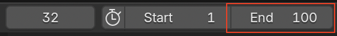

## Cuadros claves (o "Keyframing")

For key frame animation, the animator creates images for particular points in the animation and the computer works out all the other images in between. Por ejemplo, si el auto empieza en su posición actual y, cuatro segundos después, debería estar junto al muñeco de nieve, la computadora encontrará una forma de dirigir el auto desde la posición inicial hacia el muñeco de nieve, sin necesidad de crear uno por uno todos los cuadros.

En la parte inferior de la ventana de Blender, hay una línea de tiempo con una caja azul.

There are 24 frames in 1 second. This animation will last 4 seconds, so set the end frame to 96.

\--- task \---

Localiza la casilla del cuadro final o, **End frame**, al final de la pantalla.

\--- /task \---

\--- task \---

Set the **End frame** by typing `96` into the box, then press <kbd>Enter</kbd>.

\--- /task \---