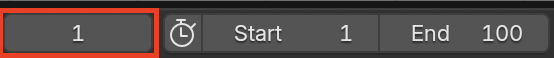
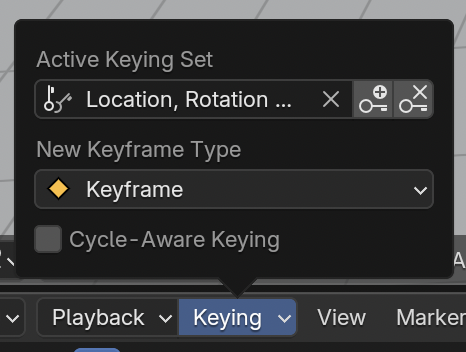
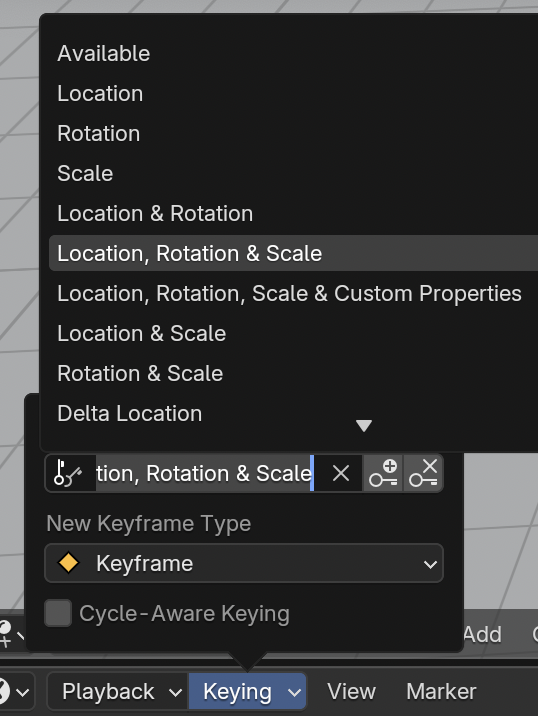

## Crea el primer cuadro clave

El auto está en el primer cuadro en la posición inicial, y debería estar al lado del muñeco de nieve en el cuadro 90.

Establezcamos el cuadro 1 como el primer cuadro clave. Es como si le dijéramos a la computadora «En el cuadro 1, recuerda que estás aquí»

+ Asegúrate de que estés en el cuadro 1 revisando el número de cuadro sobre la linea de tiempo.

+ Asegúrate de que el auto esté seleccionado —haz clic en él para seleccionarlo.

+ Haz clic en el menú desplegable **Keying** sobre la línea de tiempo, y configura la casilla de "Active Keying Set" en **LocRotScale** para guardar la ubicación, la rotación, y la escala del auto en el primer cuadro.

La computadora determinará dónde se encuentra el auto, hacia dónde se dirige, cómo gira y qué tan grande es la rotación.

+ Haz clic en el icono de la llave con el símbolo + que se encuentra a la derecha del icono **Active Keying Set** para crear un cuadro clave.

Puedes observar que el cuadro clave está identificado por un diamante amarillo en la línea de tiempo.