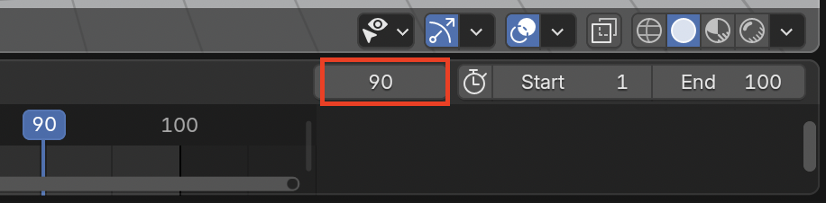
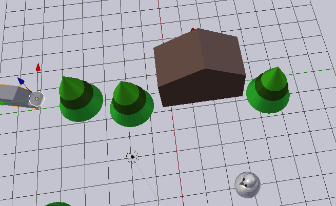

## Crea el último cuadro clave

+ Mueve la caja azul al cuadro 90 de la línea de tiempo.

+ Mueve el auto junto al muñeco de nieve usando la herramienta para mover y las flechas azul, verde y roja.

Ahora el auto está al lado del muñeco de nieve en el cuadro 90.

+ De nuevo, haz clic en el icono de la **Llave +**. Un diamante amarillo debería aparecer en la línea de tiempo del cuadro 90.

La computadora se encargará de todos los pasos de la animación entre el cuadro 1 y el cuadro 90.

+ Mueve la caja azul al cuadro 0 de la línea de tiempo.

+ Haz clic en **Play** en los controles de la parte inferior.

El auto se trasladará desde su posición inicial hacia el costado del muñeco de nieve. Sin embargo, hay un pequeño problema: ¡el auto se mete directamente por los árboles en lugar de bordearlos!

