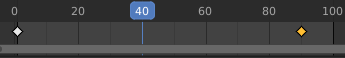
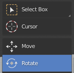

## Ajusta detalles en la animación

Sería mucho mejor si el auto manejara entre los árboles y luego se dirigiera hacia el muñeco de nieve. Cerca del cuadro 40 (aproximadamente 2 segundos) de la animación, el auto debe estar entre los árboles.

\--- task \---

Haz clic en el botón **Pause** en los controles para detener la animación.

\--- /task \---

\--- task \---

Mueve la caja azul al cuadro 40 en la línea de tiempo.

\--- /task \---

\--- task \---

Coloca el auto en una posición correcta entre los árboles.

\--- /task \---

\--- task \---

Select the **Rotate** tool and rotate the car so that it is pointing in the direction of the snowman.

\--- /task \---

\--- task \---

Haz clic en el icono de la **Llave +** para crear un nuevo cuadro clave. En la línea del tiempo, ahora debería haber 3 diamantes amarillos.

\--- /task \---

\--- task \---

Haz clic en **Play** para ver el resultado. Seguramente parece como si el auto se moviera sobre hielo. Es gracioso, pero lo suficientemente bueno por ahora. Intenta mejorar la animación.

\--- /task \---