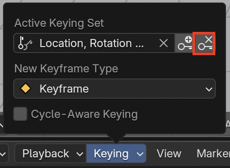
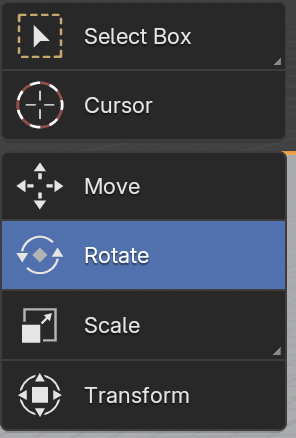

## Ajusta detalles en la animación

Sería mucho mejor si el auto manejara entre los árboles y luego se dirigiera hacia el muñeco de nieve. Cerca del cuadro 40 (aproximadamente 2 segundos) de la animación, el auto debe estar entre los árboles.

+ Haz clic en el botón **Pause** en los controles para detener la animación.

+ Mueve la caja azul al cuadro 40 en la línea de tiempo.

+ Coloca el auto en una posición correcta entre los árboles.

+ Haz clic en el icono de la **Llave +** para crear un nuevo cuadro clave. En la línea del tiempo, ahora debería haber 3 diamantes amarillos.

+ Haz clic en botón **Play**.

Ahora el auto bordea los árboles y se dirige hacia el muñeco de nieve. Sin embargo, habrás notado que el ángulo del auto (su rotación) hace parecer que el auto se desliza en lugar de trasladarse. Esto se puede arreglar rotando el coche en el cuadro 40 también.

+ Selecciona el cuadro 40 en la línea de tiempo y elimina el cuadro clave que acabas de crear haciendo clic en el icono de la llave con la x al lado.

+ Selecciona la herramienta **Rotate** para rotar.

+ Gira el auto para que apunte en dirección al muñeco de nieve.

+ Haz clic en el icono de la **Llave +** para agregar un nuevo cuadro clave.

+ Haz clic en **Play** para ver el resultado. Seguramente parece como si el auto se moviera sobre hielo. Es gracioso, pero lo suficientemente bueno por ahora. Intenta mejorar la animación.