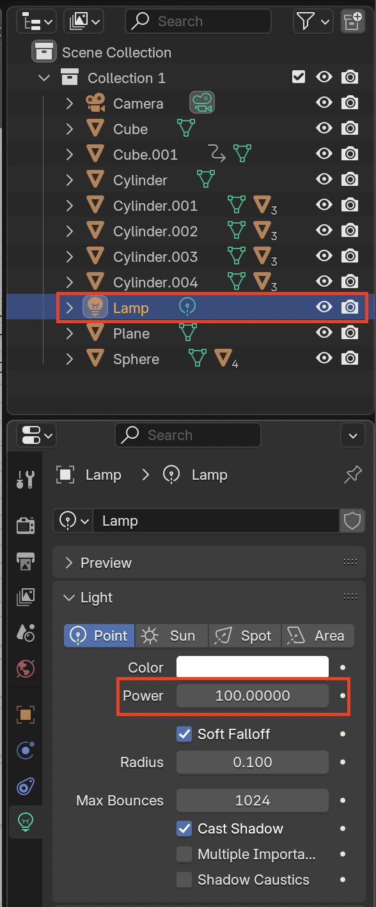

## कैमरा कहाँ है?

+ [स्टार्टर प्रोजेक्ट](resources/snow-scene-starter.blend){:target="_blank"} डाउनलोड करें और खोलें।

आप इस मार्ग का पालन करने के लिए कार को एनिमेट करेंगे:

एनिमेट करते समय आपको सबसे पहले यह जाँच करनी चाहिए कि कैमरा कहाँ है।

+ यह देखने के लिए कि दृश्य कैसा दिखाई देता है <kbd>F12</kbd> दबाकर (या यदि आप मैक का उपयोग कर रहे हैं तो <kbd>FN + F12</kbd> दबाकर) दृश्य प्रस्तुति में जाएँ।

कैमरे का कोण पूरी तरह सही नहीं है, क्योंकि आप स्क्रीन के निचले भाग में स्नोमैन के सिर का केवल ऊपरी हिस्सा देख सकते हैं, पूरा स्नोमैन नहीं।

+ दृश्य प्रस्तुति से बाहर निकलने के लिए <kbd>ESC</kbd> (एस्केप) दबाएँ।

+ Click on the camera to select it.

+ अपने दृश्य को तब तक थोड़ा-थोड़ा घुमाते रहें जब तक आपको कैमरा और दृश्य दोनों दिखाई न देने लग जाएँ।

+ Select the move tool and move the camera down using the blue handle.

+ यह देखने के लिए कि क्या अब आप पूरा स्नोमैन देख पाते हैं या नहीं, दुबारा <kbd>F12</kbd> (मैक पर <kbd>FN + F12</kbd>) को दबाकर दृश्य प्रस्तुति में जाएँ।

यदि नहीं, तो दृश्य प्रस्तुति से बाहर निकलें और कैमरे को थोड़ा और नीचा करें। अगर कैमरा बहुत नीचा है, तो इसे थोड़ा सा ऊपर खींचें। प्रस्तुति और जाँच करना तब तक जारी रखें जब तक आपको सब कुछ दिखाई न दे। If the scene is too dark, select the Lamp and increase the Power value.

