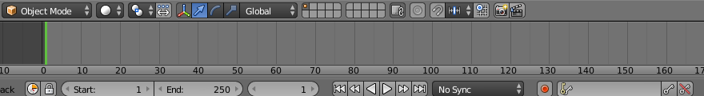
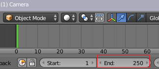

## मुख्य फ्रेम बनाना

आइए आपकी कार को एनिमेट करें!

स्टॉप फ्रेम एनिमेशन (जिसे स्टॉप मोशन एनिमेशन भी कहते हैं) के लिए आपको अपने सभी फ्रेम स्वयं बनाने होते हैं। यह बहुत बड़ा काम है, यही कारण है कि आप **मुख्य फ्रेम तैयार करना** का उपयोग करने जा रहे हैं।

मुख्य फ्रेम एनिमेशन के लिए, एनिमेटर एनिमेशन में विशेष स्थानों के लिए छवियाँ बनाता है और कंप्यूटर को बीच की अन्य सभी छवियाँ तैयार करने के लिए कहता है। उदाहरण के लिए, यदि आपकी कार अपनी वर्तमान स्थिति से शुरू होती है और चार सेकंड बाद उसे स्नोमैन के बगल में होना चाहिए, तो कंप्यूटर कार को शुरू की स्थिति से चला कर स्नोमैन तक ले जाने का कोई तरीका तैयार करेगा - आपको सभी फ्रेम स्वयं बनाने की ज़रूरत नहीं है।

At the bottom of the Blender window, there is a timeline with a blue box.

फिलहाल यह 250 फ्रेम पर सेट है, जिसका मतलब है कि एनिमेशन के लिए कंप्यूटर से 250 छवियों की आउटपुट प्राप्त होगी। 1 सेकंड में 24 फ्रेम हैं, इसलिए 250 छवियों से आपको 10 सेकंड से थोड़े अधिक का एनिमेशन मिलेगा। इस प्रोजेक्ट के लिए, आपको केवल 4 सेकंड से थोड़े अधिक का एनिमेशन चाहिए, तो चलिए अंतिम फ्रेम को 100 पर सेट करते हैं।

+ स्क्रीन के निचले हिस्से में **End frame** (अंतिम फ्रेम) के लिए बॉक्स ढूँढें।

+ **अंतिम फ्रेम** को सेट करने के लिए बॉक्स में `100` टाइप करें, फिर <kbd>Enter</kbd> (एंटर) दबाएँ।