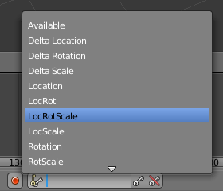

## मुख्य फ्रेम पहला फ्रेम

फ्रेम 1 में कार अपनी आरंभ स्थिति में है, और फ्रेम 90 में इसे स्नोमैन के बगल में होना चाहिए।

चलिए फ्रेम 1 को पहले मुख्य फ्रेम के रूप में सेट करते हैं। यह कंप्यूटर को यह बताने जैसा है कि "फ्रेम 1 पर, याद रखें कि आप यहाँ पर हैं।"

+ Make sure that you are on frame 1 by checking the frame number above the timeline.

+ Make sure that the car is selected — click on it to select it.

+ Click the **Keyring** dropdown menu above the timeline, and set the Active Keyring Set to **LocRotScale** to record the location, rotation, and scale of the car in the start frame.

कंप्यूटर यह जाँच करेगा कि कार कहाँ पर है, इसका मुँह किस तरफ है, इसे किस तरह घुमाया जाना है, और यह कितनी बड़ी है।

+ Click on the small key with the + on the right-hand side of the **Active Keyring Set** icon to create a key frame.

You can see the key frame represented by a yellow diamond on the timeline.