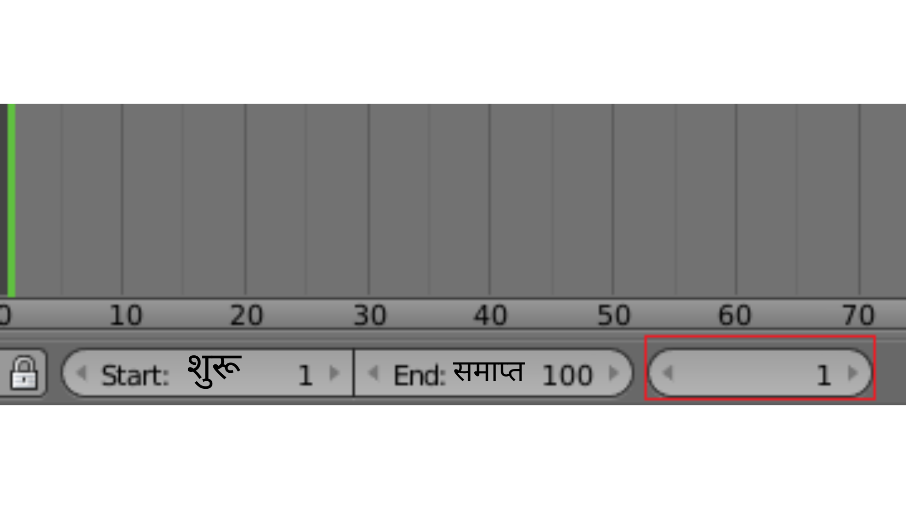
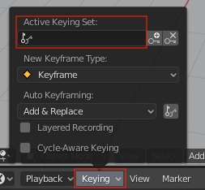

## मुख्य फ्रेम पहला फ्रेम

फ्रेम 1 में कार अपनी आरंभ स्थिति में है, और फ्रेम 90 में इसे स्नोमैन के बगल में होना चाहिए।

Set frame 1 as the first key frame.

\--- task \---

Make sure that you are on frame 1 by checking the frame number above the timeline.

\--- /task \---

\--- task \---

सुनिश्चित करें कि कार का चयन किया गया है - इसे चुनने के लिए इस पर क्लिक करें।

\--- /task \---

\--- task \---

Click the **Keying** dropdown menu above the timeline, and set the Active Keying Set to **Location, Rotation and Scale** to record the location, rotation, and scale of the car in the start frame.

\--- /task \---

कंप्यूटर यह जाँच करेगा कि कार कहाँ पर है, इसका मुँह किस तरफ है, इसे किस तरह घुमाया जाना है, और यह कितनी बड़ी है।

\--- task \---

Click on the small key with the + on the right-hand side of the **Active Keying Set** icon to create a key frame.

आप टाइमलाइन पर पीले रंग की हीरे द्वारा दर्शाया गया मुख्य फ्रेम देख सकते हैं। **Tip:** You may have to increase the height of your timeline before the diamond becomes visible.

\--- /task \---