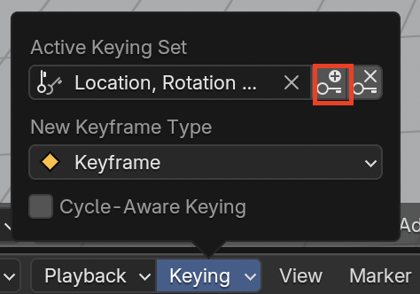

## मुख्य फ्रेम अंतिम फ्रेम

+ टाइमलाइन पर नीली वर्ग को फ्रेम 90 पर ले जाएँ।

+ नीले, हरे और लाल हैंडल का उपयोग करके कार को स्नोमैन के बगल में ले जाएँ।

अब कार फ्रेम 90 में स्नोमैन के बगल में है।

+ **Key** (कुंजी) आइकन को फिर से क्लिक करें। टाइमलाइन पर फ्रेम 90 पर एक पीली हीरे दिखाई देनी चाहिए।

कंप्यूटर फ्रेम 1 और फ्रेम 90 के बीच के एनिमेशन के सभी चरणों का समाधान करेगा।

+ टाइमलाइन पर नीली वर्ग को फ्रेम 0 पर ले जाएँ।

+ नीचे दिए गए कंट्रोल्स पर **Play** (प्ले) को क्लिक करें।

कार अपनी आरंभ की स्थिति से स्नोमैन के बगल में चली जाएगी। हालांकि, एक छोटा सा मुद्दा है - कार पेड़ों के इर्द-गिर्द जाने के बजाय सीधे पेड़ों में चली जाती है!

