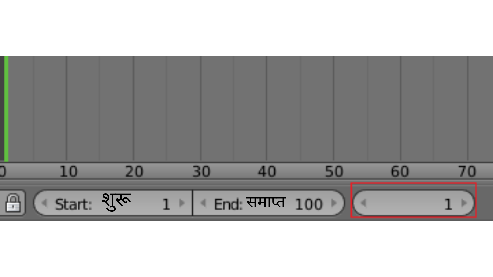
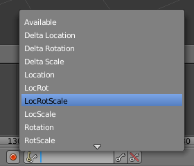

## मुख्य फ्रेम पहला फ्रेम

फ्रेम 1 में कार अपनी आरंभ स्थिति में है, और फ्रेम 90 में इसे स्नोमैन के बगल में होना चाहिए।

चलिए फ्रेम 1 को पहले मुख्य फ्रेम के रूप में सेट करते हैं। यह कंप्यूटर को यह बताने जैसा है कि "फ्रेम 1 पर, याद रखें कि आप यहाँ पर हैं।"

+ टाइमलाइन में नीचे फ्रेम संख्या की जाँच करके सुनिश्चित करें कि आप फ्रेम 1 पर हैं।

+ सुनिश्चित करें कि कार का चयन किया गया है - इसे चुनने के लिए इस पर राइट-क्लिक करें।

+ टाइमलाइन के नीचे **कुंजियाँ** आइकन पर क्लिक करें और आरंभ के फ्रेम में कार के स्थान, रोटेशन और स्केल को रिकॉर्ड करने के लिए **लोकरोटस्केल** का चयन करें।

The computer will work out where the car is, which way it is facing, how it is rotated, and how big it is.

+ मुख्य फ्रेम बनाने के लिए **कुंजियाँ** आइकन के दाईं ओर छोटी कुंजी पर क्लिक करें।

You can see the key frame represented by a yellow bar on the timeline.