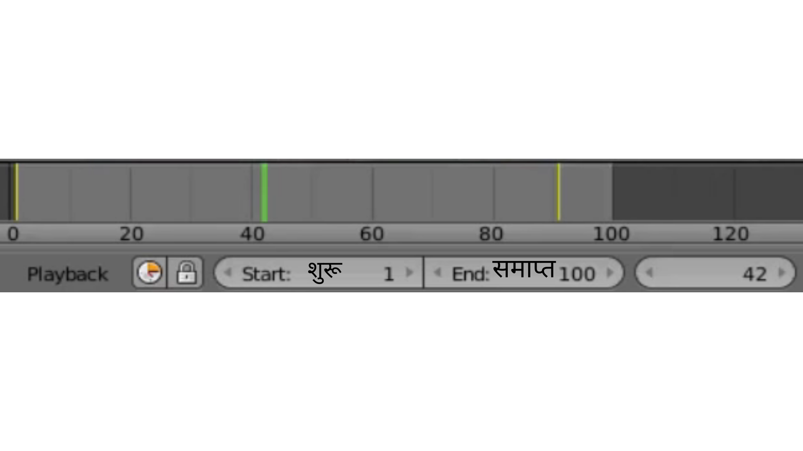
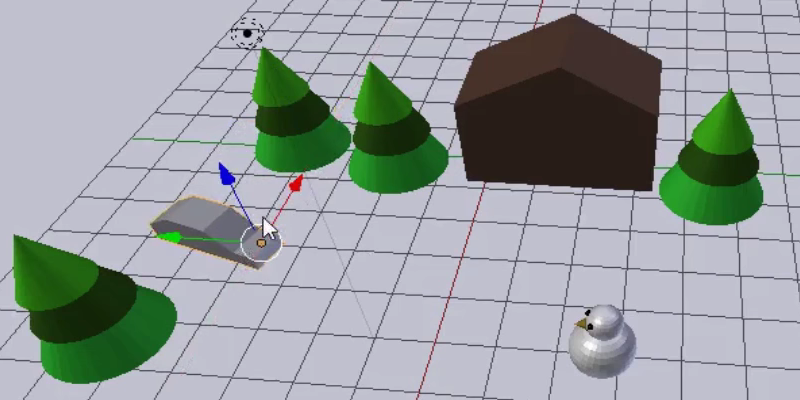
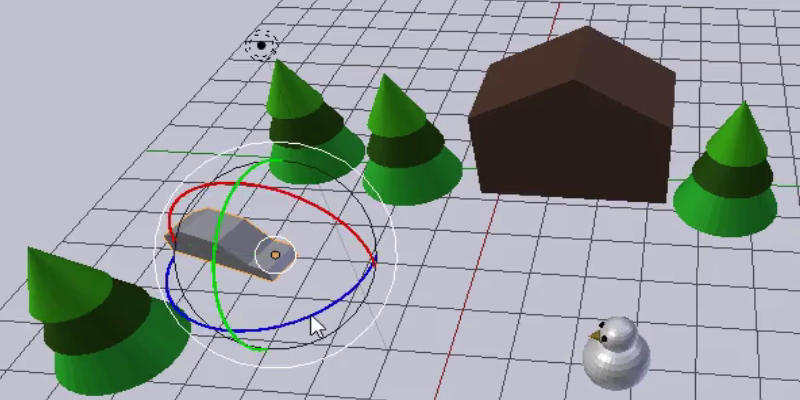

## एनिमेशन फाइन-ट्यून करें

यह ज़्यादा बेहतर होगा यदि कार पहले पेड़ों के बीच में से जाए और फिर स्नोमैन की तरफ जाए। एनिमेशन के फ्रेम 40 के आसपास (लगभग 2 सेकंड) तक, कार को पेड़ों के बीच में होना चाहिए।

\--- task \---

एनिमेशन को रोकने के लिए कंट्रोल्स पर **Pause** (पॉज़) बटन पर क्लिक करें।

\--- /task \---

\--- task \---

टाइमलाइन पर नीली वर्ग को फ्रेम 40 पर ले जाएँ।

\--- /task \---

\--- task \---

कार को पेड़ों के बीच में से किसी अच्छी जगह पर ले जाएँ।

\--- /task \---

\--- task \---

Select the **Rotate** tool and rotate the car so that it is pointing in the direction of the snowman.

\--- /task \---

\--- task \---

एक और कुंजी फ्रेम बनाने के लिए फिर से **Key** (कुंजी) आइकन पर क्लिक करें। अब टाइमलाइन पर तीन पीली हीरे होनी चाहिए।

\--- /task \---

\--- task \---

यह देखने के लिए कि यह कैसा दिखता है **** (प्ले) पर क्लिक करें। शायद ऐसा लगता है कि कार बर्फ पर चल रही है। बहुत मज़ेदार है, लेकिन फिलहाल इतना काफी है। एनिमेशन को बेहतर बनाने की कोशिश करें।

\--- /task \---