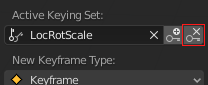

## एनिमेशन फाइन-ट्यून करें

यह ज़्यादा बेहतर होगा यदि कार पहले पेड़ों के बीच में से जाए और फिर स्नोमैन की तरफ जाए। एनिमेशन के फ्रेम 40 के आसपास (लगभग 2 सेकंड) तक, कार को पेड़ों के बीच में होना चाहिए।

+ एनिमेशन को रोकने के लिए कंट्रोल्स पर **Pause** (पॉज़) बटन पर क्लिक करें।

+ Move the blue box on the timeline to frame 40.

+ कार को पेड़ों के बीच में से किसी अच्छी जगह पर ले जाएँ।

+ Click the **Key +** icon again to create another key frame. Now there should be three yellow diamonds on the timeline.

+ **Play** (प्ले) बटन पर क्लिक करें।

कार अब पेड़ों के चारों ओर चलते हुए स्नोमैन की तरफ जाती है। हालांकि, आपने देखा होगा कि कार के कोण (इसके रोटेशन) से ऐसा लगता है कि कार चल नहीं रही है बल्कि स्लाइड कर रही है। आप फ्रेम 40 में भी कार को रोटेट करके इसे ठीक कर सकते हैं।

+ Select frame 40 on the timeline and remove the key frame you just made by clicking the key with the x beside it.

+ Select the **Rotate** tool.

+ कार को इस तरह घुमाएँ कि वह स्नोमैन की दिशा में हो।

+ Click the **Key +** icon to re-add the key frame.

+ यह देखने के लिए कि यह कैसा दिखता है **** (प्ले) पर क्लिक करें। शायद ऐसा लगता है कि कार बर्फ पर चल रही है। बहुत मज़ेदार है, लेकिन फिलहाल इतना काफी है। एनिमेशन को बेहतर बनाने की कोशिश करें।