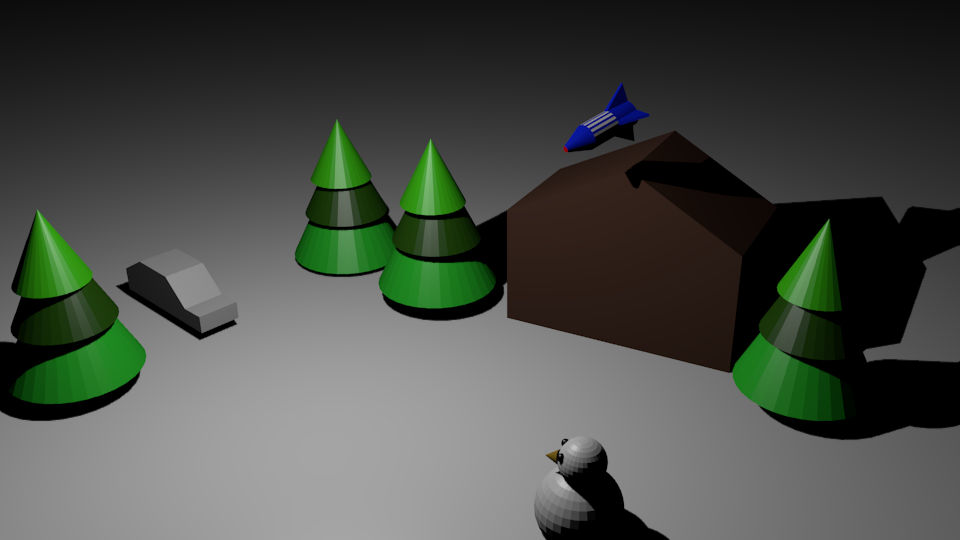
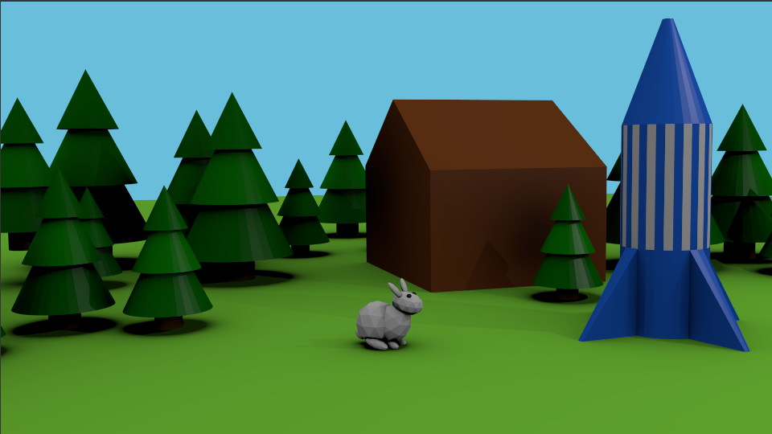

## चुनौती: रॉकेट लॉन्च करें

+ झोपड़ी के पीछे एक रॉकेट छिपा हुआ है। क्या आप इसे लॉन्च करने, दृश्य में उड़ाने और स्नोमैन को स्क्वैश करने के लिए प्राप्त कर सकते हैं?

+ [यहाँ](resources/bunny-challenge.blend) एनिमेट करने के लिए आप एक और दृश्य डाउनलोड कर सकते हैं। यह इस तरह दिखता है:

***
इस परियोजना का अनुवाद स्वयंसेवकों ने किया:

बी के कार्तिक

राहुल सिन्हा

स्वयंसेवकों को धन्यवाद, हम दुनिया भर के लोगों को अपनी भाषा में सीखने का मौका दे सकते हैं। आप स्वेच्छा से अधिक लोगों तक पहुँचने में मदद कर सकते हैं - [rpf.io/translate](https://rpf.io/translate) पर अधिक जानकारी प्राप्त करें।