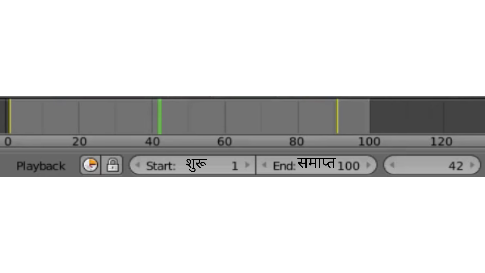

## एनिमेशन फाइन-ट्यून करें

यह ज़्यादा बेहतर होगा यदि कार पहले पेड़ों के बीच में से जाए और फिर स्नोमैन की तरफ जाए। एनिमेशन के फ्रेम 40 के आसपास (लगभग 2 सेकंड) तक, कार को पेड़ों के बीच में होना चाहिए।

+ एनिमेशन को रोकने के लिए कंट्रोल्स पर **Pause** (पॉज़) बटन पर क्लिक करें।

+ टाइमलाइन पर हरे रंग की पट्टी को फ्रेम 40 पर ले जाएँ, या नीचे बॉक्स में 40 टाइप करें।

+ कार को पेड़ों के बीच में से किसी अच्छी जगह पर ले जाएँ।

+ एक और कुंजी फ्रेम बनाने के लिए फिर से **Key** (कुंजी) आइकन पर क्लिक करें। अब टाइमलाइन पर तीन पीली पट्टियाँ होनी चाहिए।

+ **Play** (प्ले) बटन पर क्लिक करें।

कार अब पेड़ों के चारों ओर चलते हुए स्नोमैन की तरफ जाती है। हालांकि, आपने देखा होगा कि कार के कोण (इसके रोटेशन) से ऐसा लगता है कि कार चल नहीं रही है बल्कि स्लाइड कर रही है। आप फ्रेम 40 में भी कार को रोटेट करके इसे ठीक कर सकते हैं।

+ टाइमलाइन पर फ्रेम 40 का चयन करें और आपने अभी-अभी जो मुख्य फ्रेम बनाया है उसके बीच में से जाती हुई लाइन के साथ की कुंजी पर क्लिक करके उसे हटा दें।

+ **Rotation** (रोटेशन) टूल का चयन करें।

+ कार को इस तरह घुमाएँ कि वह स्नोमैन की दिशा में हो।

+ मुख्य फ्रेम को फिर से जोड़ने के लिए **Key** (कुंजी) आइकन पर क्लिक करें।

+ यह देखने के लिए कि यह कैसा दिखता है **** (प्ले) पर क्लिक करें। शायद ऐसा लगता है कि कार बर्फ पर चल रही है। बहुत मज़ेदार है, लेकिन फिलहाल इतना काफी है। एनिमेशन को बेहतर बनाने की कोशिश करें।