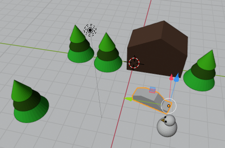

## Key frame the end frame

+ Move the blue box on the timeline to frame 90.

+ Move the car next to the snowman using the move tool and the blue, green, and red handles.

Now the car is next to the snowman in frame 90.

+ Click the small **Key +** icon again. A yellow diamond should appear on the timeline at frame 90.

The computer will work out all the steps of the animation in between frame 1 and frame 90.

+ Move the blue box on the time line to frame 0.

+ Click **Play** on the controls at the bottom.

The car will move from its starting position to next to the snowman. However, there is a bit of an issue — the car drives directly into the trees rather than going around them!

