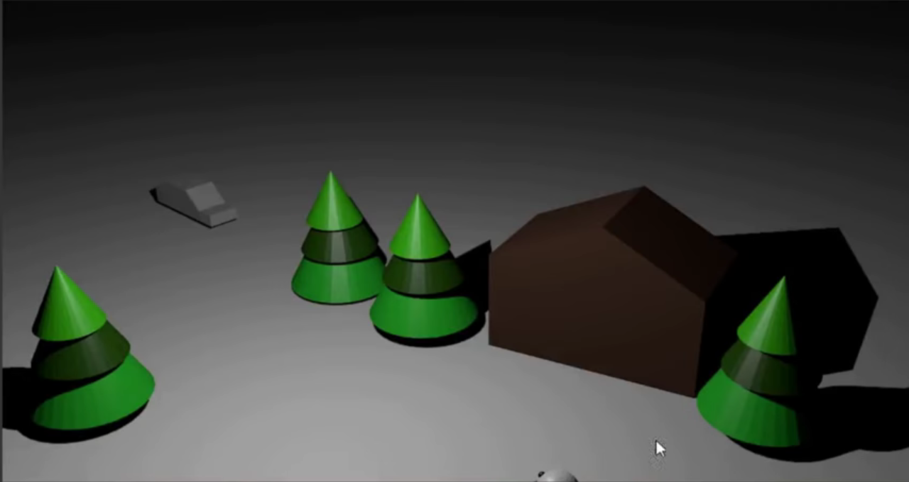
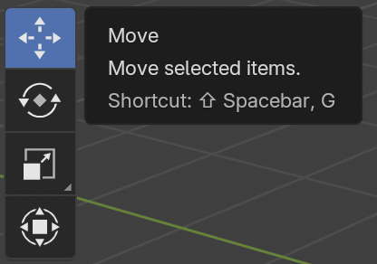
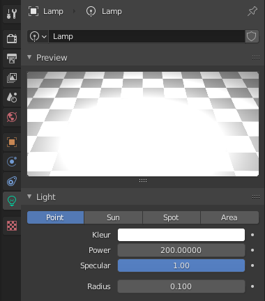
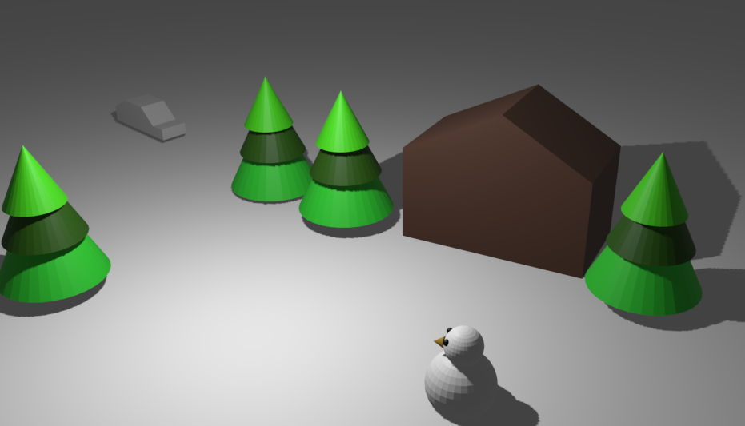

## Waar is de camera?

+ Download en open het [startproject](resources/snow-scene-starter.blend){:target="_blank"}.

Je animeert de auto om deze route te volgen:

Het eerste wat je moet doen bij het animeren is controleren waar de camera is.

+ Ga naar de renderweergave door op <kbd>F12</kbd> (of <kbd>FN + F12</kbd> als je een Mac gebruikt) te drukken om te zien hoe de scène eruitziet.

De camerahoek klopt niet helemaal, want je kunt alleen het topje van het hoofd van de sneeuwpop onder in het scherm zien, en niet de hele sneeuwpop.

+ Druk op <kbd>ESC</kbd> om de renderweergave te verlaten.

+ Klik op de camera om deze te selecteren.

+ Draai je beeld een beetje totdat je zowel de camera als de scène kunt zien.

+ Selecteer het verplaatsingsgereedschap (Move) en beweeg de camera omlaag met het blauwe handvat.

+ Ga naar de renderweergave door <kbd>F12</kbd> (<kbd>FN + F12</kbd> op een Mac) te drukken om te controleren of je nu de hele sneeuwpop kunt zien.

Als dit niet het geval is, verlaat de renderweergave en laat de camera iets verder zakken. Als de camera te laag staat, trek hem dan een klein stukje omhoog. Ga door met renderen en controleer totdat je alles in beeld hebt. Als de scène te donker is, selecteer dan de Lamp en verhoog de waarde van Power (vermogen).

