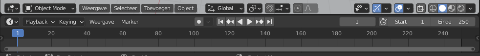
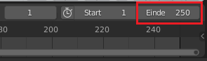

## Sleutelbeelden

Laten we je auto animeren!

Voor een stopframe-animatie (ook wel stop-motionanimatie genoemd) moet je alle frames (beelden) zelf maken. Dit is een hoop werk, daarom ga je **keyframing** (sleutelbeelden) gebruiken.

Voor keyframe-animaties maakt de animator afbeeldingen voor bepaalde punten in de animatie en vraagt de computer om alle andere afbeeldingen daartussen uit te werken. Als je auto bijvoorbeeld start op zijn huidige positie en vier seconden later zou hij naast de sneeuwpop moeten zijn, dan zal de computer een manier bedenken om de auto van de startpositie naar de sneeuwpop te rijden — je hoeft niet alle beelden zelf te maken.

Onderaan het Blender-venster is er een tijdlijn met een blauw vak.

Momenteel is deze ingesteld op 250 frames, wat betekent dat de computer voor de animatie 250 beelden uitvoert. Er zitten 24 frames in 1 seconde, dus 250 beelden geven je iets meer dan 10 seconden aan animatie. Voor dit project wil je slechts iets meer dan 4 seconden animatie, dus laten we het eindbeeld op 100 zetten.

+ Zoek het vak voor **Eindbeeld** onderaan het scherm.

+ Stel het **Eindbeeld** in door `100` in het vak in te typen en druk vervolgens op <kbd>Enter</kbd>.