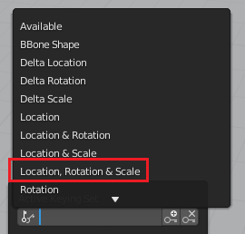

## Het eerste sleutelbeeld

De auto staat op de startpositie in beeld 1 en zou naast de sneeuwpop moeten staan in beeld 90.

Laten we beeld 1 instellen als het eerste sleutelbeeld. Dit is alsof je de computer vertelt "Op beeld 1, onthoud dat je hier bent."

+ Zorg ervoor dat je op beeld 1 staat door het beeldnummer boven de tijdlijn te controleren.

+ Zorg ervoor dat de auto is geselecteerd — klik erop om hem te selecteren.

+ Klik op het **Keying** boven de tijdlijn en stel de Active Keying Set in op **** om de locatie, rotatie en schaal van de auto in het startframe vast te leggen.

De computer zal uitrekenen waar de auto is, in welke richting hij staat, hoe hij gedraaid staat en hoe groot hij is.

+ Klik op de kleine toets met het + aan de rechterkant van het **Active Keying Set** pictogram om een sleutelframe te maken.

Je kunt het sleutelbeeld zien, vertegenwoordigd door een gele diamant op de tijdlijn.