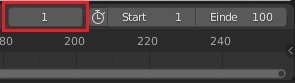
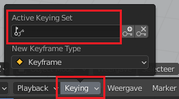
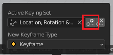

## Het eerste sleutelbeeld

De auto staat op de startpositie in beeld 1 en zou naast de sneeuwpop moeten staan in beeld 90.

Set frame 1 as the first key frame.

\--- task \---

Make sure that you are on frame 1 by checking the frame number above the timeline.

\--- /task \---

\--- task \---

Zorg ervoor dat de auto is geselecteerd — klik erop om hem te selecteren.

\--- /task \---

\--- task \---

Click the **Keying** dropdown menu above the timeline, and set the Active Keying Set to **Location, Rotation and Scale** to record the location, rotation, and scale of the car in the start frame.

\--- /task \---

De computer zal uitrekenen waar de auto is, in welke richting hij staat, hoe hij gedraaid staat en hoe groot hij is.

\--- task \---

Klik op de kleine toets met het + aan de rechterkant van het **Active Keying Set** pictogram om een sleutelframe te maken.

Je kunt het sleutelbeeld zien, vertegenwoordigd door een gele diamant op de tijdlijn. **Tip:** You may have to increase the height of your timeline before the diamond becomes visible.

\--- /task \---