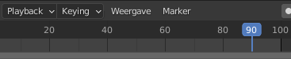
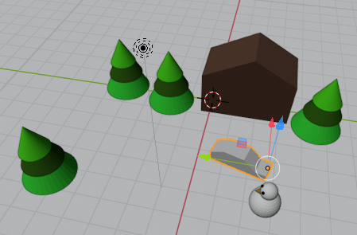
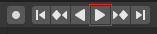

## Het laatste sleutelbeeld

+ Verplaats het blauwe vak op de tijdlijn naar beeld 90.

+ Verplaats de auto tot naast de sneeuwpop met behulp van het verplaatsingsgereedschap en de blauwe, groene en rode handvatten.

Nu staat de auto naast de sneeuwpop in beeld 90.

+ Klik nogmaals op het kleine **Sleutel +** pictogram. Een gele diamant zou op de tijdlijn moeten verschijnen bij beeld 90.

De computer berekent alle stappen van de animatie tussen beeld 1 en beeld 90.

+ Verplaats het blauwe vak op de tijdlijn naar beeld 0.

+ Klik op **Afspelen** op de bedieningselementen onderaan.

De auto zal van zijn startpositie naar de plaats naast de sneeuwpop rijden. Er is echter een klein probleem: de auto rijdt dwars door de bomen heen in plaats van er omheen!

