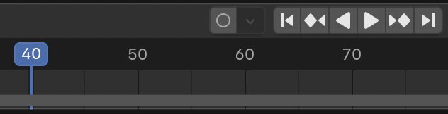

## Verfijn de animatie

Het zou veel beter zijn als de auto tussen de bomen door reed en dan richting de sneeuwpop. Bij ongeveer beeld 40 (ongeveer 2 seconden) van de animatie moet de auto tussen de bomen staan.

+ Klik op de **Pauze** knop op de bedieningselementen om de animatie te stoppen.

+ Verplaats het blauwe vak op de tijdlijn naar beeld 40.

+ Verplaats de auto naar een goede positie tussen de bomen.

+ Klik nogmaals op het pictogram **Sleutel +** om nog een sleutelbeeld te maken. Nu zouden er drie gele diamanten op de tijdlijn moeten staan.

+ Klik op de knop **Afspelen**.

De auto rijdt nu om de bomen heen richting de sneeuwpop. Het is je misschien opgevallen dat de auto door de hoek van de auto (de rotatie) lijkt te glijden in plaats van te rijden. Je kunt dit oplossen door de auto ook te draaien in beeld 40.

+ Selecteer beeld 40 op de tijdlijn en verwijder het sleutelbeeld dat je zojuist hebt gemaakt door op de toets met de x ernaast te klikken.

+ Selecteer het **Roteer** gereedschap.

+ Draai de auto zodat deze in de richting van de sneeuwpop wijst.

+ Klik op het pictogram **Sleutel +** om het sleutelbeeld opnieuw toe te voegen.

+ Klik op **Afspelen** om te zien hoe het eruit ziet. Het ziet er waarschijnlijk uit alsof de auto op ijs rijdt. Best grappig, maar voorlopig goed genoeg. Probeer de animatie te verbeteren.