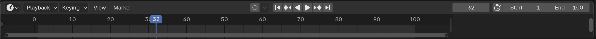

## Keyframing

For key frame animation, the animator creates images for particular points in the animation and the computer works out all the other images in between. For example, if your car starts at its current position and four seconds later it should be next to the snowman, the computer will work out a way of driving the car from the start position to the snowman — you don't have to create all the frames by yourself.

At the bottom of the Blender window, there is a timeline with a blue box.

There are 24 frames in 1 second. This animation will last 4 seconds, so set the end frame to 96.

\--- task \---

Locate the box for **End frame** at the bottom of the screen.

\--- /task \---

\--- task \---

Set the **End frame** by typing `96` into the box, then press <kbd>Enter</kbd>.

\--- /task \---