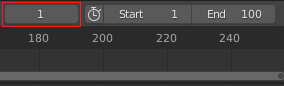

## Key frame the first frame

The car is at its starting position in frame 1, and it should be next to the snowman in frame 90.

Set frame 1 as the first key frame.

\--- task \---

Make sure that you are on frame 1 by checking the frame number above the timeline.

\--- /task \---

\--- task \---

Make sure that the car is selected — click on it to select it.

\--- /task \---

\--- task \---

Click the **Keying** dropdown menu above the timeline, and set the Active Keying Set to **Location, Rotation and Scale** to record the location, rotation, and scale of the car in the start frame.

\--- /task \---

The computer will work out where the car is, which way it is facing, how it is rotated, and how big it is.

\--- task \---

Click on the small key with the + on the right-hand side of the **Active Keying Set** icon to create a key frame.

You can see the key frame represented by a yellow diamond on the timeline. **Tip:** You may have to increase the height of your timeline before the diamond becomes visible.

\--- /task \---