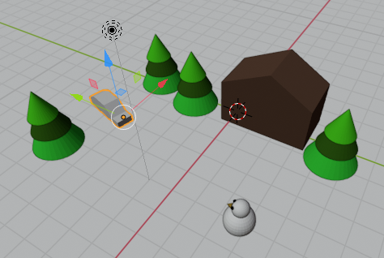
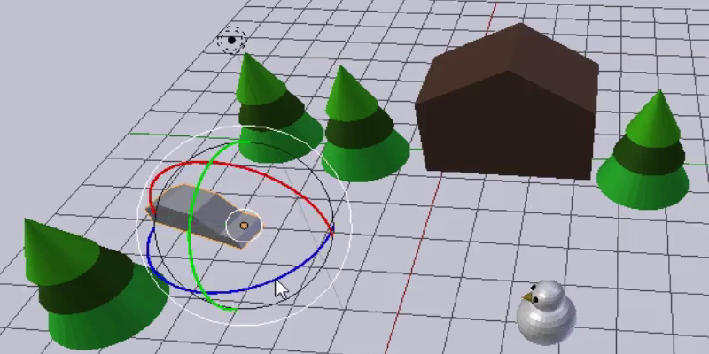

## Fine-tune the animation

It would be much better if the car drove between the trees and then towards the snowman. At about frame 40 (approx. 2 seconds) of the animation, the car needs to be between the trees.

\--- task \---

Click the **Pause** button on the controls to stop the animation.

\--- /task \---

\--- task \---

Move the blue box on the timeline to frame 40.

\--- /task \---

\--- task \---

Move the car to a good position between the trees.

\--- /task \---

\--- task \---

Select the **Rotate** tool and rotate the car so that it is pointing in the direction of the snowman.

\--- /task \---

\--- task \---

Click the **Key +** icon again to create another key frame. Now there should be three yellow diamonds on the timeline.

\--- /task \---

\--- task \---

Click **Play** to see what it looks like. It probably looks like the car is driving on ice. Quite funny, but good enough for now. Try to improve the animation.

\--- /task \---